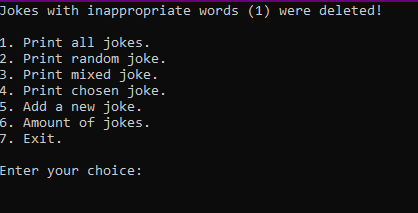

# Controls

Now you can see controls in the application.

On the main page, you can choose these options:

1. Print all jokes. (The app prints all filtered jokes)
2. Print random joke. (The app prints one of the jokes and punchlines)
3. Print mixed joke. (The app prints one of the jokes and randomly prints punchline)
4. Print chosen joke. (You can choose which joke the app should print)
5. Add a new joke. (You can add a new joke to the list of jokes)
6. Amount of jokes (The app prints amount of jokes in the list)
7. Exit (Close the application)
